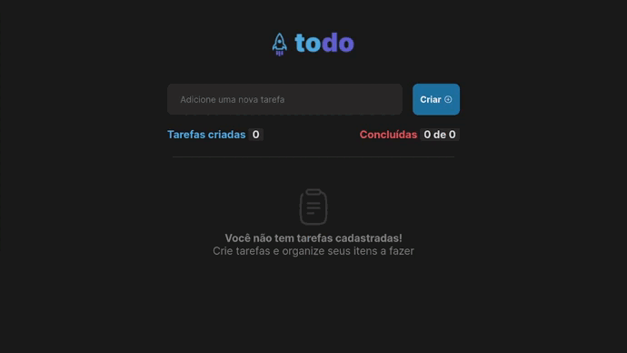

# Ignite Feed

Final project from first module of Rocketseat's Ignite - React path.

## 📲 Application

  

  
  
🔗 Application Link: [https://ignite-feed-mayra.vercel.app](https://ignite-feed-mayra.vercel.app)  
  
  
🔗 [Instructions provided by Rocketseat - Link](https://efficient-sloth-d85.notion.site/Desafio-01-Praticando-os-conceitos-do-ReactJS-91fd63dd1a5b4a2796152de293ec1074)  
🔗 [Figma provided by Rocketseat - Link](https://www.figma.com/file/iuulSDu7v6TwvmMVzJWDO0/ToDo-List-Copy?fuid=1150116205413212091)  
  
## 🛠️ Technologies
  
- Style: CSS Modules;  
- Icons: Phosphor Icons;  
- Language: JS + TS;  
- Library: React;
- Deploy: Vercel.

### ✅ In this project, the following topics were covered:

- [x] Handling input values;
- [x] Create to-do items;
- [x] Delete to-do items;
- [x] Toggle complete items (if it's unchecked, the function checks, if not, the function unchecks);
- [x] Application states (useState);
- [x] useEffect;
- [x] Immutability;
- [x] TypeScript.
